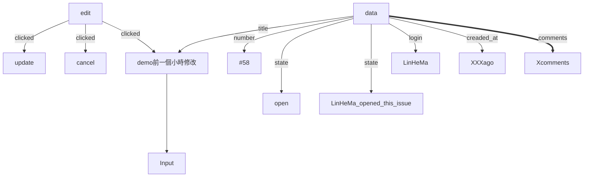

[[github_issue_clone_sprint_4]]

# API

### Get an issue
`/repos/{owner}/{repo}/issues/{issue_number}`

### Patch an issue
`/{owner}/{repo}/issues/{issue_number}`

---
# Data needed
1. title
2. state
3. body
4. login(author)
5. number
6. comments
7. created_at
8. assignees(==only show on Mobile==)
9. labels(==only show on Mobile==)
---

